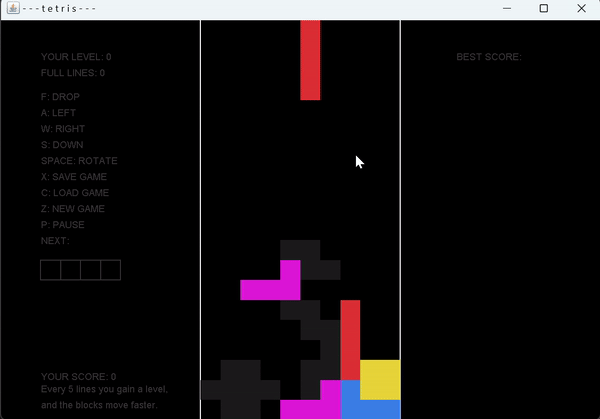

# Tetris Game

A brief description of what this project does and who it's for

## Description
This is a classic Tetris game implemented in [language/platform]. It offers a standard Tetris experience with the following features:

-Preview of the next tetromino (falling block).

-Saving game state to a file.

-Loading game state from a file.

-Top 3 high scores tracking.
## Controls
Use ← and → to move the tetromino left or right.
Use ↓ to accelerate the falling speed of the tetromino.
Use ↑ to rotate the tetromino.
Use Spacebar to instantly drop the tetromino to the bottom.

# Gif's

  

## You can download here:

https://github.com/dominikoka/application_tetris
